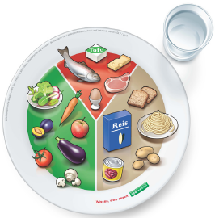

+++
title = "Die verlorene Ernährung der Jugend"
date = "2024-06-11"
draft = false
pinned = false
+++
## **Die verlorene Ernährung der Jugend**

Lautes Kassenklingeln und Stimmen, die
durcheinanderreden . Viele Schülerinnen und Schüler des Gymnasiums Kirchenfeld gehen in der Migros
Filiale an der Luisenstrasse am Mittag ein und aus. Vor den Regalen herrscht ein dichtes Gedränge . Ein M Budget Poulet Sandwich hier, drei

Donuts da. Die Gemüse und Früchteabteilung so gut wie unberührt. Das Einzige, was noch Frucht in sich hat ist das Capri Sun welches von
einem Schüler eingesteckt wird. Zurück im Gymnasium l aufen wir durch die Gänge auf der Suche nach einem freien Tisch. Viele sind schon
besetzt und grössten teils voll mit Fertiggerichten und Fast Food. Gemüse, pflanzliche Eiweisse und gesunde Fette sucht man vergeblich. Wenn
man seinen Abfall entsorgen will, wird man von Abfalleimern die bis zum Rand mit Plastikverpackungen vollgestopft sind begrüsst . Dieses Spiel
wiederholt sich von Tag zu Tag und man muss sich fragen: Ernähren sich Jugendliche überhaupt gesund und ausgewogen

Wir wollen die Meinung zu dieser Frage hören. Also gehen wir an einem regnerischen Tag in das Beau
Side Krankenhaus in der Nähe des
Viktoria Platzes. Nachdem wir zuerst mit der Tram daran vorbeigefahren waren, schreiten wir in Richtung des Klinikums und es beginnt zu
stürmen. An der Rezeption empfängt uns Frau Dr. Med. Negri und wir folgen Ihr in den langen, wirren, mit grossen Fenstern ausgekleideten
Gängen. 

Als wir in das Gebäude des Sitzungszimmers betreten, riecht es nach frisch gekochtem Mittagessen. D en ein Stock unter dem
Sprechzimmer ist die Küche, welche Essen für Patienten und Gäste zubereitet. Im Sprechzimmer, welches dazu noch die Küche der Mitarbeiter
und Mitarbeiterinnen Frau Dr. Med. Negris ist, führen wir unser Interview.
Wir wollen eine breite Aussicht haben über dieses komplizierte und in sich komplexe Thema und so fragen wir, ob sie (Frau Dr. Med. Negri) der Meinung sei, dass sich Jugendliche heutzutage nicht ausgewogen ernähren. Die Antwort auf diese Frage finden wir zu gegebenermassen
schockierend. Frau Dr. Med. Negri meint, dass nicht nur die Problematik von übermässigem Fastfood Konsum heutzutage zum Vorschein tritt, sondern auch scheinbar gesunde Ernährung Trends. Nicht alle Probleme liegen ihrer Meinung im Verzehr von Fastfood, sondern auch in den
anscheinend gesunden Ernährungsweisen, welche Trends auf z.B. TikTok zeigen. Sie verweist auf ein
Kurzvideo, welches sie selbst auf der sozialen Medien Plattform TikTok gesehen hat, eine sogenannte
Gurkendiät wird als «gesund», und «reinigend» beschrieben. Doch was dabei das Problem ist, zeigt sie
uns mithilfe einer Abbildung von der Schweizer Gesellschaft für Ernährung «SGE».
Auf der Grafik ist ein Teller abgebildet, welcher zu ein bisschen weniger als die Hälfte mit Gemüse und
Früchten belegt ist. Dabei sollte man auf grünes Blattgemüse zielen, aber auch Gurken, Tomaten,
Karotten, Zucchini und Pilze. Nicht fehlen darf ein Anteil Früchte auf dem Teller. Dazu sollte man zwischen
Äpfel, Trauben, Birnen und Erdbeeren wähle oder auch auf exotische Varianten zurückgreifen. Wichtig ist
hierbei vor allem, dass man 3 Portionen à 120 g Gemüse und 2 Portionen à 120 g Früchte pro Tag zu si ch
nehmen sollte. 

Ebenso mit Kohlenhydraten z.B. Reis, Teigwaren, Kartoffeln und Brot, dabei entspricht die
tägliche Menge jedoch 4 6 Portionen à 120 g (Brot z. B.). Für Milchprodukte, Fleisch, Fisch, Eier & Tofu
täglich 3 Portionen Milch/Milchprodukte. 1 Portion entspricht: 2 dl Milch oder150 200 g Joghurt / Quark
Hüttenkäse / andere Milchprodukte
Oder 30 g Halbhart
--/Hartkäse oder60 g
Somit sehen wir, dass eine Diät, welche vielleicht von manchen als «Gesund und ausgewogen» angepriesen wird, nicht suffizient ist. So erklärt
es uns Frau Dr. Med. Negri. Also können wir in kurze aus dieser Antwort den Schlussziehen, dass , z u einer ausgewogenen Hauptmahlzeit
 (Mittagessen, Abendessen) immer folgende vier Komponenten gehören: ein ungesüsstes Getränk, Gemüse /Salat / Früchte, ein stärereiches
Lebensmittel und ein proteinreiches Lebensmittel.

Da wir nun dank Frau Dr. Med. Negri wissen wie ein ausgewogenes Mittagessen aussehen sollte gleichen wir dies mit unseren Beobachtungen
aus dem Migros und dem Gymnasium ab. Wir kommen zur besorgniserregenden Erkenntnis, dass in den meisten Gerichten der Schüler innen und Schüler überhaupt ni cht dieser Grafik entsprechen. Man könnte nun denken, dass ein M Budget Poulet Sandwich wenigsten stärkt und
sicherlich proteinreich ist. Denn es ist wohl überall bekannt das Poulet Proteinreich ist. Bas Kast, der Autor d es Buches «Der Ernährungskompass», sagt in seinem Buch erstmal, dass wenn man längere Zeit auf Proteine verzichtet, man schlicht weg stirbt. Denn Proteine
sind die Baustoffe des Körpers wie bei einem Haus Beton, Holz oder Stahl und ohne kann gar nichts geb aut oder instand gehalten werden.

Alsoist man mit einem M Budget Poulet Sandwich auf der sicheren Seite in punkto Proteine? Nein, definitiv nicht. Bas Kast sagt in seinem Buch
auch, dass die heutige Lebensmittelindustrie die Proteine verdünnt. Das heisst die Produkte die eigentlich reich an Proteinen sind werden
durch Zucker und Fetten verdünnt. Es riecht und schmeckt noch nach Eiweissen und der Körper hat auch das Gefühl er futtert re ichlich davon
aber in Realität ist nicht so viel vorhanden. Kurz gesagt, unsere Instinkte werden ausgetrickst. Somit lautet der Tipp von Bas Kast: «Verzichten Sie auf jede Form von Industrie Food» Dazu gehört demnach auch unser M Budget Poulet Sandwich. Da geht man fast sicher, dass die Proteine
darin verdünnt wurden. Also doc h keine gute Option. Denken wir noch einmal an die Migros Filiale mit den vollen Regalen an Lebensmittel zurück. 

Der Grossteil davon ist Industrie Food und in seinen Nährstoffen verdünnt. Wir kommen zu dem Schluss, dass sich ein Mittagessen in
der Migros z usammenzustellen wohl nicht die gesündeste Option ist. Doch wo dann?
Das wohlvertraute Läuten der Klingel ertönt und besagt den Beginn eines weiteren Mittags. Anstatt den Weg in die Migros Filiale auf sich zu
nehmen , verlässt man das Schulgebäude auf der anderen Seit e und geht durch die glasige Doppeltüre in die Mensa. Auch dort herrschen laute Stimmen in der Schlange vor der Essensausgabe und die Gerüche der verschiedenen Menüs steigen einem in die Nase . Claudio Dini, der Mensa leiter, begrüsst einem freundlich und fragt welches Men ü man haben möchte. Mit einem ausgewogenen Teller mit Proteinen, Kohlenhydrate und gesunden Fetten sucht man sich einen Tisch. Wird der Teller leer gegessen kann man sich noch einmal in die Schlange stellen und eine zweite Portion der
Beilagen, Gemüse, Kartoffeln, Reis oder was gerade auf dem Menüplan steht , holen damit man auch satt ist.

In einem Gespräch erzählt uns Claudio Dini was er und das ganze Team der Mensa für die Ernährung der Schülerinnen und Schüler des Gymnasiums tun. Auf die Eröffnungsfrage , wie viele Menüs den pro Tag verkauft werden und ob er mitdieser Zahl zufrieden sei, antwortete er etwa 130 Menüs. Dies sei aber auch Tagesabh ängig . Zufrieden sei er mit einemLächeln fügt er jedoch hinzu, über mehr Schülerinnen und Schüler würde er sich natürlich freuen. Wir erklären ihm vonunseren Beobachtungen in der Migros und von unseren Bedenken über die Ernährung der Schülerinnen und Schüler hier am Gymnasium.

 Er nickt und sagt e, er verstehe das. Ihm sei es bewusst, dass viele Schülerinnen und Schüler auf ihr Geld achten müssen. Erfinde es aber schade, dass die Ernährung darunter leide.
finde es aber schade, dass die Ernährung darunter leide. Er würde sehr gerne für alle kochen und ihnen ein gesundes MittagessenEr würde sehr gerne für alle kochen und ihnen ein gesundes Mittagessen bereitstellen bereitstellen aber an den Preisen könne er leider nichts machen.aber an den Preisen könne er leider nichts machen. Wir erzählen, dass wir von Schülerinnen und Schüler Wir erzählen, dass wir von Schülerinnen und Schüler gehört habengehört haben, , dass die Portionsgrössedass die Portionsgrösse ein weiterer Grund sei, dass sie nicht in der Mensa essen.

Sie ein weiterer Grund sei, dass sie nicht in der Mensa essen. Sie fänden die Portionen zu klein und würden davon nicht satt werden. fänden die Portionen zu klein und würden davon nicht satt werden. Hier erzählt Hier erzählt uns Claudio Dini uns Claudio Dini von der Möglichkeit, sich einen zweiten Teller Beilagen von der Möglichkeit, sich einen zweiten Teller Beilagen zu holenzu holen. Davon . Davon wissen die meisten Schülerinnen und Schüler wissen die meisten Schülerinnen und Schüler jedoch jedoch nicht. Er fügt hinzunicht. Er fügt hinzu, dass wenn man in seiner Mensa essen gehe, dass wenn man in seiner Mensa essen gehe,, man auch satt wieder in den Unterricht geht. man auch satt wieder in den Unterricht geht. Wir kommen auf seine Aussage Wir kommen auf seine Aussage mit dem gesunden Mittagessen zurück und fragen ihnmit dem gesunden Mittagessen zurück und fragen ihn,, wie die Mensa auf einwie die Mensa auf ein umweltfreundliches und ausgewogenes Angebot achteumweltfreundliches und ausgewogenes Angebot achtett,, wie es wie es auf ihrer Webseite geschrieben ist. Auf ihrer Webseite geschrieben ist. Eine wichtige Frage, denn uns liegt vor allem die gesunde Ernährung der Schülerinnen und Schüler am Herzen. Claudio Dini bestätigt unsere Aussage, da sei er gleicher Meinung. Der MNI, MenüClaudio Dini bestätigt unsere Aussage, da sei er gleicher Meinung. Der MNI, Menü--NachhaltiNachhaltigkeitsgkeits--Index, sei der Schlüssel zum Index, sei der Schlüssel zum gesunden Angebot der Mensa, welches auch der Umwelt zugutekomme. gesunden Angebot der Mensa, welches auch der Umwelt zugutekomme. Er Er erklärterklärt unsuns,, dasdasss der sogenannte der sogenannte «MNI» berechnet wie gut das «MNI» berechnet wie gut das Menu für einMenu für einenen selbst ist und wie gut für die Umwelt.

Selbst ist und wie gut für die Umwelt.
Nach dem Gespräch haben wir recherchiert um noch mehr über diesen MNI herauszufinden. Der MNI wurde von der Zürcher Hochschul
Nach dem Gespräch haben wir recherchiert um noch mehr über diesen MNI herauszufinden. Der MNI wurde von der Zürcher Hochschule für e für Angewandte Wissenschaften in Zusammenarbeit mit dem ZFV, dem Unternehmen welchem die Mensa gehört, entwickeltAngewandte Wissenschaften in Zusammenarbeit mit dem ZFV, dem Unternehmen welchem die Mensa gehört, entwickelt. . Einfach gesagt ist der Einfach gesagt ist der MNI ein Bewertungssystem welches anhand von einer Vielzahl an Kriterien sagt, ob ein Gericht umweltfreundlich und ausgewogen MNI ein Bewertungssystem welches anhand von einer Vielzahl an Kriterien sagt, ob ein Gericht umweltfreundlich und ausgewogen ist. Mit zwei ist. Mit zwei Symbolen im Menüplan einer Erde (umweltfreundlich) und einem Herz (ausgewogen) werden diese FaSymbolen im Menüplan einer Erde (umweltfreundlich) und einem Herz (ausgewogen) werden diese Faktoren angezeiktoren angezeigt. Wir schauen uns den gt. Wir schauen uns den Menüplan der Mensa an und tatsächlich, hinter allen Menüs sind eins wenn nicht sogar beide dieser Symbole zu finden. Im VerglMenüplan der Mensa an und tatsächlich, hinter allen Menüs sind eins wenn nicht sogar beide dieser Symbole zu finden. Im Vergleich zu der eich zu der Migros hat die Mensa demnach nicht nur ausgewogene Menüs zu bieten, welche auch satt machen, soMigros hat die Mensa demnach nicht nur ausgewogene Menüs zu bieten, welche auch satt machen, sondern auch solche die der Umwelt ndern auch solche die der Umwelt zugutekommen. Weiter sind die Gerichte der Mensa so gut wie unberührt von der industriellen Nährstoffverdünnung. Lediglich dezugutekommen. Weiter sind die Gerichte der Mensa so gut wie unberührt von der industriellen Nährstoffverdünnung. Lediglich der Preis wäre r Preis wäre ein Gegenargument. Schlussendlichein Gegenargument. Schlussendlich mussmuss man sich jedoch die Frage stellen: Welcher Preman sich jedoch die Frage stellen: Welcher Preis hat eine Ernährung welche zu einem gesunden Leben is hat eine Ernährung welche zu einem gesunden Leben führt?führt?
Wir persönlich sind bereit diesen Preis zu bezahlen
Wir persönlich sind bereit diesen Preis zu bezahlen,, da uns unsere Gesundheit am Herzen liegt. Doch nicht nur unsere Gesundheit ist uns da uns unsere Gesundheit am Herzen liegt. Doch nicht nur unsere Gesundheit ist uns wichtigwichtig,, sondern auch die von unseren Mitschüler und Mitschülerinnensondern auch die von unseren Mitschüler und Mitschülerinnen. . Deshalb auch unsere Bitte an dieseDeshalb auch unsere Bitte an diese: : ÜbeÜberlegt rlegt doch zweimal doch zweimal ob ob ihr in ihr in die Migrodie Migros geht und euch ein Ms geht und euch ein M--Budget Poulet Sandwich kauftBudget Poulet Sandwich kauft oder oder doch ein gesundes, ausgewogenes und umweltfreundliches Menü aus der doch ein gesundes, ausgewogenes und umweltfreundliches Menü aus der Mensa kauft. Mensa kauft.